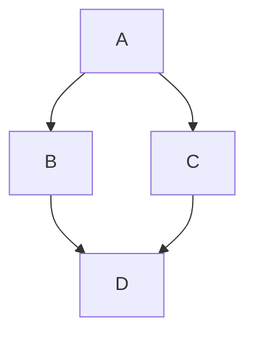

# Usage
Projects using `duck` must have a `duck.toml` configuration file, see [CONFIG.md](CONFIG.md) for the available configuration options.

## Command-line options:
To build documentation for a project:

```
duck build
```

To output JSON representing the code base:

```
duck build -d
```

### Cached Builds
It is possible to do so-called cached builds, where the JSON output from a previous build is reuse and only markdown pages are rendered again:

```
duck build --cached <file>
```

Cached builds are useful when working on documentation outside of code changes.


More command-line options can be displayed using `-h` or `--help`.


## Comments
Comments are written using `///` or `///<`, the latter being used for inline documentation, as such:

```cpp
/// Documentation for 'MyEnum'
enum MyEnum {
	A ///< Documentation for 'A' 
}
```

It is also possible to use `/**` and `/**<` C-style comments:
```c
/**
 * Documentation for 'MyEnum'
*/
enum MyEnum {
	A /**< Documentation for 'A' */
}
```


Comments content are parsed as duck-flavored markdown, there is no support for `javadoc`/Doxygen-style comments.

### Hiding elements

Elements can be hidden by annotating them with `#[doc(hidden)]`

```cpp
/// #[doc(hidden)]
struct Hidden {}
```

## Markdown syntax
`duck` introduces a few extensions to markdown.

- To link documentation objects, one must prefix the link path with `::`. For example:

```
See [MyStruct](::MyStruct)
```

- Mermaid graphs can be displayed using `mermaid` codeblocks:



## Documentation tests
`duck` supports running documentation tests akin to `rustdoc`, these tests are written in `cpp` and `c++` code blocks and help ensure that code examples are up-to-date with API usage.

Documentation code blocks feature special syntax:
- Lines prefixed with `@` won't be displayed, but will be added to the source code:

```
@int a = 1;
int b = a + 2;
```

Will only display:

```
int b = a + 2;
```

But will be compiled fully, that is with `int a = 1` included.


- Similarly, `@include` allows for quiet inclusion of a header file:

```
@include "file.h"
int a = 1;
```

Will only display:

```
int a = 1;
```

Notice that documentation tests don't need a `main` function, this is because documentation tests run by default in `main`. To disable this behavior one must set the codeblock language to `nomain` instead of `c++` or `cpp`.


### Test framework
`duck` includes a basic test framework for documentation tests, this is useful for testing that examples still run successfully.
The following macros are defined:

- `ASSERT` and `ASSERT_EQ`: test for truth and equality, respectively
- `ASSERT_FALSE` and `ASSERT_NE`: test for falsity and inequality, respectively
- `ASSERT_GT` and `ASSERT_LT`: test for greater than and less than, respectively
- `ASSERT_GE` and `ASSERT_LE`: test for greater than or equal and less than or equal, respectively

Therefore, it is possible to write code like so:

```c++
int a = 1;
ASSERT(a == 1);
```

The code above will compile and run successfully, but the following code will fail to run:

```c++
int a = 2;
ASSERT(a == 1);
```


# Styling
`duck` expects a `style.css` file to be present at the root of the generated documentation and generates a `highlight.css` file from the syntax highlighting theme. It is recommended to put the style sheets in a static directory and set the `static` option in the configuration file.
